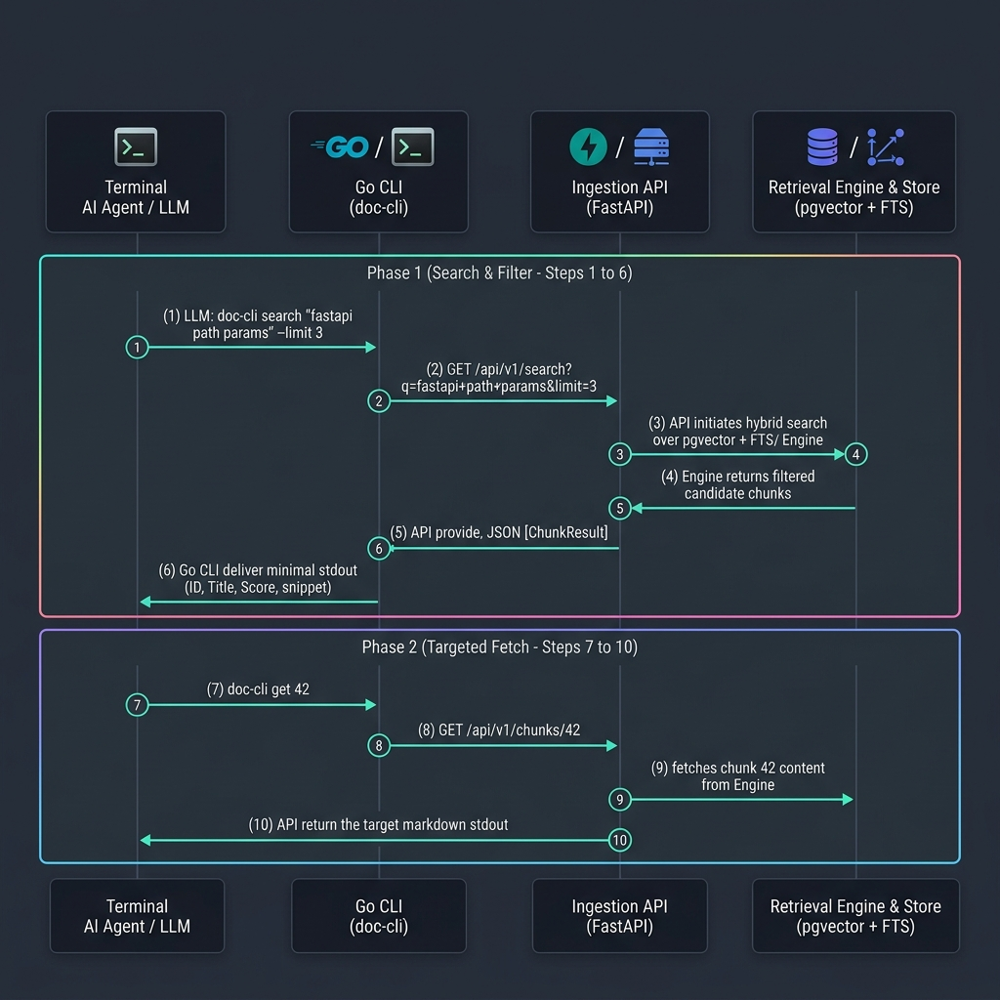

# self-docs

<p align="center">
  
</p>

> A self-hosted documentation RAG pipeline for LLM agents — crawl static docs
> sites, embed them locally with pgvector, and serve semantic search over the
> Model Context Protocol.

<p>
  
  
  
  
  
</p>

**self-docs** gives your coding agents (Cursor, Claude Code, Antigravity, or any
MCP client) a private, always-current reference library. It crawls upstream
documentation sites, chunks and embeds them locally — no third-party embedding
API — and exposes hybrid semantic search as MCP tools over streamable HTTP.

---

## Contents

- [Why self-docs](#why-self-docs)
- [Architecture](#architecture)
- [Quickstart — Local Development](#quickstart--local-development)
- [Go CLI & Progressive Disclosure Skill (`doc-cli`)](#go-cli--progressive-disclosure-skill-doc-cli)
- [Quickstart — Production (Home-Lab + Traefik)](#quickstart--production-home-lab--traefik)
- [MCP Tools & REST Endpoints](#mcp-tools--rest-endpoints)
- [Managing Sources](#managing-sources)
- [Documentation](#documentation)
- [Development](#development)
- [License](#license)


---

## Why self-docs

- **Local-first embeddings.** FastEmbed runs in-process on CPU (ONNX, no
  GPU/torch); documentation never leaves your network. The model is selectable
  from a registry (`config/models.yaml`) — `make configure` derives the vector
  dimension and container memory limits from your choice. Default:
  `mixedbread-ai/mxbai-embed-large-v1` (1024-dim).
- **Hybrid retrieval.** Vector similarity + per-source-language Postgres
  full-text search over `pgvector`, so exact terms and semantic matches both
  surface.
- **Efficient re-crawling.** Sources can prefer a site's
  [llms.txt](https://llmstxt.org) index over HTML crawling, and re-syncs use
  HTTP conditional GET (`ETag`/`If-Modified-Since`) to skip unchanged pages
  before download — see [ADR-003](docs/adr/003-llms-txt-etag-multilang-fts.md).
- **Agent-native.** Ships as MCP tools (`search_docs`, `list_doc_sources`,
  `propose_doc_source`) over streamable HTTP — wire it into any MCP client.
- **Operator-friendly.** Crawl targets live in the database, managed through a
  loopback-only admin UI or proposed by agents for human approval.
- **Self-hostable.** One `docker compose` stack; a Traefik overlay for
  home-lab ingress.

## Architecture

```
  Cursor ──┐            ┌─────────┐   ┌──────────────┐
  Claude ──┼─ HTTP ──▶  │ Traefik │──▶│ FastMCP srv  │──┐
  Antigrav ┘  /mcp      └─────────┘   │ (search_docs,│  │ SQL
                               │      │  propose_    │  │
  doc-cli (Go CLI / Skill) ───▶│      │  doc_source) │  ▼
  (/api/v1/search, /get)       │      └──────────────┘ ┌────────┐
  operator ── loopback ───────▶│      │ Ingestion    │▶│ pg16 + │
  (/admin UI, 127.0.0.1:8080)  └─────▶│ svc (FastAPI)│ │pgvector│
  internal scheduler ────────────────▶└──────────────┘ └────────┘
  (opt-in, per-source cron)
```

| Layer | Technology |
|-------|------------|
| Store | PostgreSQL 16 + pgvector 0.8.2 |
| Embeddings | FastEmbed · `mixedbread-ai/mxbai-embed-large-v1` (default, selectable — see `config/models.yaml`) |
| MCP server | FastMCP 3.x (streamable HTTP) |
| CLI & Skill | `doc-cli` Go binary + embedded progressive disclosure AI agent skill |
| Ingestion & REST API | FastAPI crawler + chunker + scheduler + `/api/v1/*` progressive disclosure endpoints |
| Ingress | Traefik (production overlay) |


Source configuration (crawl targets, URL prefixes, schedule) lives in the
`doc_sources` table — **not** a YAML file. Sources are managed through the
loopback-only admin UI at `/admin`, or proposed by an agent via the
`propose_doc_source` MCP tool (which queues a `pending` row for human approval
and never crawls on its own). The ingestion service includes an opt-in in-process
cron scheduler (`app.scheduler`) for automated re-crawling; see the
[Runbook](docs/runbook.md) for configuration details.

## Quickstart — Local Development

```bash
cp .env.example .env        # fill in real values
make configure              # optional — pick an embedding model (see below)
make up                     # db + ingestion (:8080) + mcp-server (:8081)
make sync                   # trigger the initial documentation sync
```

`make configure` is optional: with no `.env` overrides both services already use
the registry default. Run it to choose a different model —
`make configure MODEL=BAAI/bge-base-en-v1.5` — and it resolves that model's
vector dimension, query/passage prompts, and per-service memory limits into
`.env`, then re-renders `db/init/01_schema.sql`. Switching models on an existing
deployment requires a re-embed; see
[Runbook → switch the embedding model](docs/runbook.md#switch-the-embedding-model).

Point local MCP clients at `http://127.0.0.1:8081/mcp` (streamable HTTP). The
server requires an `Authorization: Bearer <MCP_TOKEN>` header — see
[Client Setup](docs/client-setup.md) for per-client configuration.

## Go CLI & Progressive Disclosure Skill (`doc-cli`)

`doc-cli` is a high-performance Go CLI and progressive disclosure skill that allows terminal AI agents (and human operators) to query self-docs efficiently over the REST API (`/api/v1/*`).

```bash
# Install binary (~/.local/bin/doc-cli) and register global AI skill (~/.gemini/config/skills/doc-cli/SKILL.md)
make install
```

### Agent Progressive Disclosure Protocol (3-Step Workflow)

<p align="center">
  
</p>

1. **Search First (Token-Efficient Candidate Fetch)**:
   ```bash
   doc-cli search "fastapi dependency injection" --limit 3
   ```
   *Returns candidate chunk IDs, heading paths, relevance scores, and 1-line snippets.*

2. **Inspect Candidate IDs**:
   Agent evaluates the candidate IDs and heading paths returned.

3. **Targeted Fetch by ID**:
   ```bash
   doc-cli get 42
   ```
   *Fetches exact markdown content for the specified chunk ID.*

### Skill Diagnostics & Management

```bash
doc-cli skill status         # Check global/project skill installation and API health
doc-cli skill install        # Install skill globally (~/.gemini/config/skills/doc-cli/SKILL.md)
doc-cli skill install --project # Install skill locally (.agents/skills/doc-cli/SKILL.md)
```

## Quickstart — Production (Home-Lab + Traefik)


Deploy behind Traefik ingress on a home-lab server:

```bash
cp .env.example .env                    # set credentials + DOCS_MCP_HOSTNAME
export MCP_TOKEN=$(openssl rand -hex 32)  # required — persist this in .env
make up-prod                            # applies docker-compose.prod.yml overlay
make sync                               # trigger the initial documentation sync
```

> [!IMPORTANT]
> **`MCP_TOKEN` is mandatory.** If it is missing from `.env`, `mcp-server`
> fails fast on startup and restart-loops. When upgrading an existing
> deployment, update every client config with the `Authorization` header
> **before or alongside** restarting `mcp-server`. Follow the
> [MCP_TOKEN upgrade checklist](docs/runbook.md#deploy--upgrade--mcp_token-requirement-read-before-restarting-mcp-server)
> in the runbook.

## MCP Tools & REST Endpoints

### MCP Server Tools (Streamable HTTP)

| Tool | Description |
|------|-------------|
| `search_docs(query, source?, limit?)` | Hybrid vector + full-text search over indexed docs |
| `list_doc_sources()` | List indexed documentation sets with sync status |
| `propose_doc_source(name, base_url, max_pages, ...)` | Propose a new source; lands as `pending` and stays uncrawlable until approved in the admin UI — never crawls itself |

### Ingestion Service REST Endpoints (`/api/v1/*`)

| Endpoint | Subcommand / Usage | Description |
|----------|-------------------|-------------|
| `GET /api/v1/search?q=<query>&limit=3` | `doc-cli search "<query>"` | Fast hybrid search returning candidate IDs, scores, and snippets (~50–150 tokens) |
| `GET /api/v1/chunks/{id}` | `doc-cli get <id>` | Targeted retrieval returning full markdown content for a specific chunk |
| `GET /api/v1/tree` | `doc-cli tree` | Hierarchy overview of indexed doc sources, page counts, and sync timestamps |


## Managing Sources

| Action | How |
|--------|-----|
| Add / edit / remove a source | Admin UI at `http://127.0.0.1:8080/admin` (loopback only) |
| Agent-proposed source | `propose_doc_source` MCP tool → `pending` → human approval |
| Trigger a sync | `make sync` (or the per-source internal scheduler) |
| Approval workflow | [Runbook → adding sources](docs/runbook.md) |

## Documentation

| Guide | What's inside |
|-------|---------------|
| **[Client Setup](docs/client-setup.md)** | Connect Cursor, Claude Code, and Antigravity |
| **[Runbook](docs/runbook.md)** | DB migration, adding sources, the internal scheduler, backup/restore, troubleshooting |
| **[Architecture Decisions](docs/adr/)** | ADRs documenting key design choices |

## Development

```bash
# Start an isolated db for testing
docker compose -f docker-compose.yml -f docker-compose.test.yml up -d db

# Run the full suite (unit + integration + e2e)
make test

# Run the retrieval-quality eval (requires a synced db)
make eval

# Lint and static type checks (also enforced in CI)
make lint
make typecheck
```

Backup and restore are available via `make backup`, `make backup-prune`, and
`make restore FILE=backups/docs_<timestamp>.dump` — see the
[Runbook](docs/runbook.md) for the full procedure.

## License

Private — not published. All rights reserved; see [LICENSE](LICENSE).
