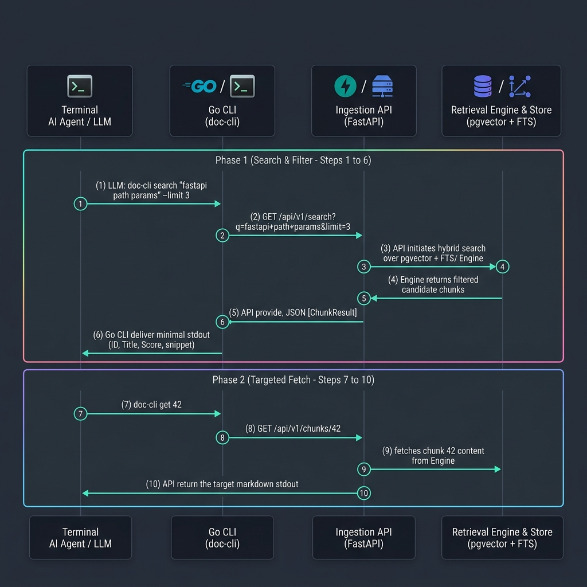

# self-docs

<p align="center">
  
</p>

> A self-hosted documentation RAG pipeline for LLM agents — crawl static docs
> sites or upload files directly, embed them locally with pgvector, and serve 
> semantic search over the Model Context Protocol.

<p>
  
  
  
  
  
</p>

**self-docs** gives your coding agents (Cursor, Claude Code, Antigravity, or any
MCP client) a private, always-current reference library. It crawls upstream
documentation sites and indexes uploaded documents, chunks and embeds them locally — no third-party embedding
API — and exposes hybrid semantic search as MCP tools over streamable HTTP.

---

## Known issue — a fresh install with default `.env` values is broken

> [!WARNING]
> **If you are doing a first install, read this before `make up`.** This does
> **not** affect the existing production deployment (its `doc_chunks.embedding`
> column and `.env` are already on `BAAI/bge-small-en-v1.5` / 384-dim) — it
> only affects **new deployments that accept the shipped defaults**.
>
> `config/models.yaml`'s registry default was switched to
> `BAAI/bge-small-en-v1.5` (384-dim) and `db/init/01_schema.sql` was
> regenerated to create `doc_chunks.embedding vector(384)`. But three other
> places that should have moved with it were not updated, and still default to
> the old `mixedbread-ai/mxbai-embed-large-v1` (1024-dim):
> - `docker-compose.yml` (`EMBEDDING_MODEL_NAME`/`EMBEDDING_DIM` env defaults)
> - `ingestion/app/embedder.py` (`DEFAULT_MODEL_NAME`/`DEFAULT_EMBEDDING_DIM`)
> - `mcp-server/app/retrieval.py` (`DEFAULT_MODEL_NAME`)
>
> and `.env.example` shipped with `EMBEDDING_MODEL_NAME`/`EMBEDDING_DIM`
> commented out. The result: `cp .env.example .env && make up` on an **empty
> volume** creates a `vector(384)` column, then the services embed at
> 1024-dim — every `doc_chunks` insert fails at sync time.
>
> **Workaround — do this before your first `make up`:** set the following in
> `.env` (this is now also the value `.env.example` ships with):
> ```bash
> EMBEDDING_MODEL_NAME=BAAI/bge-small-en-v1.5
> EMBEDDING_DIM=384
> ```
> This must happen **before** the first `docker compose up`, because
> `db/init/*.sql` only runs against an empty Postgres data directory. If you
> already ran `make up` with the broken defaults, tear down the volume and
> start over: `docker compose down -v db && make up`.
>
> **Separately:** if you are instead upgrading an **existing** 1024-dim
> database, there is no migration provided for the dimension change on this
> branch — the `DO` block that used to handle exactly this in
> `db/init/03_fix_embedding_dim.sql` was removed (that file now only contains
> unrelated `doc_sources` URL/sitemap fixups). Do not attempt to reconfigure an
> existing 1024-dim deployment to 384-dim without a manual re-embed plan; see
> [Runbook → switch the embedding model](docs/runbook.md#switch-the-embedding-model).
>
> **The two failing tests you may notice are expected, not cosmetic:**
> `mcp-server/tests/test_registry_defaults.py::test_retrieval_defaults_match_registry_default`
> and
> `tests/test_model_registry.py::test_ingestion_embedder_defaults_match_registry_default`
> fail on an unconfigured checkout because they assert the `DEFAULT_*`
> constants above match `config/models.yaml`'s registry default — they are
> the automated symptom of this exact inconsistency. `make test` only shows
> green because it hardcodes `EMBEDDING_DIM=384 EMBEDDING_MODEL_NAME=BAAI/bge-small-en-v1.5`
> for every suite it runs, which masks the problem rather than fixing it. They
> will go green once `docker-compose.yml`, `embedder.DEFAULT_MODEL_NAME`/
> `DEFAULT_EMBEDDING_DIM`, and `retrieval.DEFAULT_MODEL_NAME` are aligned to
> the registry default — tracked as follow-up work, not done in this change.

---

## Contents

- [Known issue — a fresh install with default `.env` values is broken](#known-issue--a-fresh-install-with-default-env-values-is-broken)
- [Why self-docs](#why-self-docs)
- [Architecture](#architecture)
- [Quickstart — Local Development](#quickstart--local-development)
- [Go CLI & Progressive Disclosure Skill (`doc-cli`)](#go-cli--progressive-disclosure-skill-doc-cli)
- [Quickstart — Production (Home-Lab + Traefik)](#quickstart--production-home-lab--traefik)
- [MCP Tools & REST Endpoints](#mcp-tools--rest-endpoints)
- [Managing Sources](#managing-sources)
- [Documentation](#documentation)
- [Development](#development)
- [License](#license)


---

## Why self-docs

- **Broad Indexing.** The pipeline indexes both crawled sites **and** uploaded documents (Markdown/text, HTML, PDF, zip bundles).
- **Local-first embeddings.** FastEmbed runs in-process on CPU (ONNX, no
  GPU/torch); documentation never leaves your network. The model is selectable
  from a registry (`config/models.yaml`) — `make configure` derives the vector
  dimension and container memory limits from your choice. Default:
  `BAAI/bge-small-en-v1.5` (384-dim). *(Note: See the Known issue above for code-level fallbacks).*
- **Hybrid retrieval.** Vector similarity + per-source-language Postgres
  full-text search over `pgvector`, so exact terms and semantic matches both
  surface.
- **Efficient re-crawling.** Sources can prefer a site's
  [llms.txt](https://llmstxt.org) index over HTML crawling, and re-syncs use
  HTTP conditional GET (`ETag`/`If-Modified-Since`) to skip unchanged pages
  before download — see [ADR-003](docs/adr/003-llms-txt-etag-multilang-fts.md). An optional headless `renderer` service is also available for single-page applications.
- **Agent-native.** Ships as MCP tools (`search_docs`, `list_doc_sources`,
  `propose_doc_source`, `upload_doc_text`) over streamable HTTP — wire it into any MCP client.
- **Operator-friendly.** Crawl targets and upload sources live in the database, managed through a
  loopback-only admin UI or proposed by agents for human approval.
- **Self-hostable.** One `docker compose` stack; a Traefik overlay for
  home-lab ingress.

## Architecture

```text
  Cursor ──┐            ┌─────────┐   ┌──────────────┐
  Claude ──┼─ HTTP ──▶  │ Traefik │──▶│ FastMCP srv  │──┐
  Antigrav ┘  /mcp      └─────────┘   │ (search,     │  │ SQL
                               │      │  propose,    │  │
  doc-cli (Go CLI / Skill) ───▶│      │  upload)     │  ▼
  (/api/v1/search, /get)       │      └──────────────┘ ┌────────┐
  operator ── loopback ───────▶│      │ Ingestion    │▶│ pg16 + │
  (/admin UI, 127.0.0.1:8080)  └─────▶│ svc (FastAPI)│ │pgvector│
  internal scheduler ────────────────▶└─────────┬────┘ └────────┘
  (opt-in, per-source cron)                     │
                                                ▼
                                      ┌─────────────────┐
                                      │ headless        │
                                      │ renderer (opt)  │
                                      └─────────────────┘
```

| Layer | Technology | Description |
|-------|------------|-------------|
| **Store** | PostgreSQL 16 + pgvector 0.8.2 | Stores metadata, crawl/upload sources, and embeddings. |
| **Embeddings** | FastEmbed | `BAAI/bge-small-en-v1.5` (registry default, selectable via `config/models.yaml`) |
| **MCP server** | FastMCP 3.x (streamable HTTP) | Exposes search, proposal, and upload tools to AI agents. |
| **CLI & Skill** | `doc-cli` Go binary + embedded skill | Progressive disclosure AI agent skill for token-efficient retrieval. |
| **Ingestion** | FastAPI crawler & API | Handles crawling, document uploads, chunking, and progressive disclosure endpoints (`/api/v1/*`). |
| **Renderer** | Headless Browser (Optional) | Resolves JavaScript-heavy or SPA documentation sources. |
| **Ingress** | Traefik | Production overlay for secure home-lab routing. |

Source configuration (crawl targets, URL prefixes, upload sources, schedule) lives in the `doc_sources` table — **not** a YAML file. 

Sources can be of two `source_type`s: **crawl** or **upload**. They are managed through the loopback-only admin UI at `/admin`, or (for crawl sources) proposed by an agent via the `propose_doc_source` MCP tool (which queues a `pending` row for human approval and never crawls on its own). The ingestion service includes an opt-in in-process cron scheduler (`app.scheduler`) for automated re-crawling; see the [Runbook](docs/runbook.md) for configuration details.

## Quickstart — Local Development

```bash
cp .env.example .env        # fill in real values
make configure              # optional — pick an embedding model (see below)
make up                     # db + ingestion (:8080) + mcp-server (:8081)
make sync                   # trigger the initial documentation sync
```

> [!WARNING]
> See the [Known issue](#known-issue--a-fresh-install-with-default-env-values-is-broken)
> above before running `make up` for the first time — an unmodified
> `.env.example` copy currently ships with the correct `EMBEDDING_MODEL_NAME`/
> `EMBEDDING_DIM` values already uncommented, but if you hand-edit those lines
> or skip copying `.env.example` verbatim, double-check they say
> `BAAI/bge-small-en-v1.5` / `384` before your first `make up`.

`make configure` is optional: with no `.env` overrides both services already use
the registry default. Run it to choose a different model —
`make configure MODEL=BAAI/bge-base-en-v1.5` — and it resolves that model's
vector dimension, query/passage prompts, and per-service memory limits into
`.env`, then re-renders `db/init/01_schema.sql`. Switching models on an existing
deployment requires a re-embed; see
[Runbook → switch the embedding model](docs/runbook.md#switch-the-embedding-model).

Point local MCP clients at `http://127.0.0.1:8081/mcp` (streamable HTTP). The
server requires an `Authorization: Bearer <MCP_TOKEN>` header — see
[Client Setup](docs/client-setup.md) for per-client configuration.

## Go CLI & Progressive Disclosure Skill (`doc-cli`)

`doc-cli` is a high-performance Go CLI and progressive disclosure skill that allows terminal AI agents (and human operators) to query self-docs efficiently over the REST API (`/api/v1/*`).

```bash
# Install binary (~/.local/bin/doc-cli) and register global AI skill (~/.gemini/config/skills/doc-cli/SKILL.md)
make install
```

### Agent Progressive Disclosure Protocol (3-Step Workflow)

<p align="center">
  
</p>

1. **Search First (Token-Efficient Candidate Fetch)**:
   ```bash
   doc-cli search "fastapi dependency injection" --limit 3
   ```
   *Returns candidate chunk IDs, heading paths, relevance scores, and 1-line snippets.*

2. **Inspect Candidate IDs**:
   Agent evaluates the candidate IDs and heading paths returned.

3. **Targeted Fetch by ID**:
   ```bash
   doc-cli get 42
   ```
   *Fetches exact markdown content for the specified chunk ID.*

### Skill Diagnostics & Management

```bash
doc-cli skill status         # Check global/project skill installation and API health
doc-cli skill install        # Install skill globally (~/.gemini/config/skills/doc-cli/SKILL.md)
doc-cli skill install --project # Install skill locally (.agents/skills/doc-cli/SKILL.md)
```

## Quickstart — Production (Home-Lab + Traefik)

Deploy behind Traefik ingress on a home-lab server:

```bash
cp .env.example .env                    # set credentials + DOCS_MCP_HOSTNAME
export MCP_TOKEN=$(openssl rand -hex 32)  # required — persist this in .env
make up-prod                            # applies docker-compose.prod.yml overlay
make sync                               # trigger the initial documentation sync
```

> [!IMPORTANT]
> **`MCP_TOKEN` is mandatory.** If it is missing from `.env`, `mcp-server`
> fails fast on startup and restart-loops. When upgrading an existing
> deployment, update every client config with the `Authorization` header
> **before or alongside** restarting `mcp-server`. Follow the
> [MCP_TOKEN upgrade checklist](docs/runbook.md#deploy--upgrade--mcp_token-requirement-read-before-restarting-mcp-server)
> in the runbook.

## MCP Tools & REST Endpoints

### MCP Server Tools (Streamable HTTP)

| Tool | Description |
|------|-------------|
| `search_docs(query, source?, limit?)` | Hybrid vector + full-text search over indexed docs. <br/>*(Note: `upload://` URLs from uploaded sources render as plain text)* |
| `list_doc_sources()` | List indexed documentation sets with sync status. **Now reports `source_type`** (crawl or upload). |
| `propose_doc_source(name, base_url, max_pages, ...)` | Propose a new source; lands as `pending` and stays uncrawlable until approved in the admin UI — never crawls itself. |
| `upload_doc_text(source, title, content)` | Writes a page of Markdown/text into an **existing** upload-type source. <br/>**Limits**: 1 MB content, 200-character title. Re-uploading the same title replaces the page. |

### Ingestion Service REST Endpoints (`/api/v1/*`)

| Endpoint | Subcommand / Usage | Description |
|----------|-------------------|-------------|
| `GET /api/v1/search?q=<query>&limit=3` | `doc-cli search "<query>"` | Fast hybrid search returning candidate IDs, scores, and snippets (~50–150 tokens) |
| `GET /api/v1/chunks/{id}` | `doc-cli get <id>` | Targeted retrieval returning full markdown content for a specific chunk |
| `GET /api/v1/tree` | `doc-cli tree` | Hierarchy overview of indexed doc sources, page counts, and sync timestamps |

## Managing Sources

| Action | How |
|--------|-----|
| Add / edit / remove a source | Admin UI at `http://127.0.0.1:8080/admin` (loopback only). |
| Create an upload source | Admin UI "Create Source" form using the "Uploaded files" radio button. |
| Populate an upload source | 1. **Admin UI**: Edit-page upload form.<br/>2. **CLI**: `make upload SOURCE=<name> PATH=<file_or_dir>`<br/>3. **MCP Tool**: `upload_doc_text(source, title, content)` |
| Agent-proposed source | `propose_doc_source` MCP tool → `pending` → human approval. |
| Trigger a sync | `make sync` (or the per-source internal scheduler). |
| Approval workflow | [Runbook → adding sources](docs/runbook.md) |

## Documentation

| Guide | What's inside |
|-------|---------------|
| **[Client Setup](docs/client-setup.md)** | Connect Cursor, Claude Code, and Antigravity |
| **[Runbook](docs/runbook.md)** | DB migration, [adding sources](docs/runbook.md#add-a-new-doc-source), [upload sources](docs/runbook.md#upload-sources), scheduler, backup/restore, troubleshooting |
| **[Architecture Decisions](docs/adr/)** | ADRs documenting key design choices, including [ADR-005: Uploads as a Source Type](docs/adr/005-document-uploads-as-a-source-type.md). |

## Development

```bash
# Start an isolated db for testing
docker compose -f docker-compose.yml -f docker-compose.test.yml up -d db

# Run the full suite (unit + integration + e2e)
make test

# Run the retrieval-quality eval (requires a synced db)
make eval

# Lint and static type checks (also enforced in CI)
make lint
make typecheck
```

### Data & System Operations

| Command | Action |
|---------|--------|
| `make upload SOURCE=<name> PATH=<file_or_dir>` | Uploads local files or directories to an upload-type source. |
| `make purge` | Purges the database of indexed chunks for a source. |
| `make refresh` | Purges then immediately recrawls a source. |
| `make stop` | Stops an active sync. |
| `make reindex` | Re-embeds the entire corpus (e.g. after changing models). |
| `make test-db-up` | Brings up the testing database. |
| `make test-db-down` | Tears down the testing database. |
| `make test-db-reset` | Resets the testing database to a fresh state. |

> [!WARNING]
> Backup and restore are available via `make backup`, `make backup-prune`, and
> `make restore FILE=backups/docs_<timestamp>.dump` — see the
> [Runbook](docs/runbook.md) for the full procedure. Note that `make purge` or restoring a database without `pg_dump` backup will permanently lose any **uploaded** documents unless you have the original files.

## License

Private — not published. All rights reserved; see [LICENSE](LICENSE).
